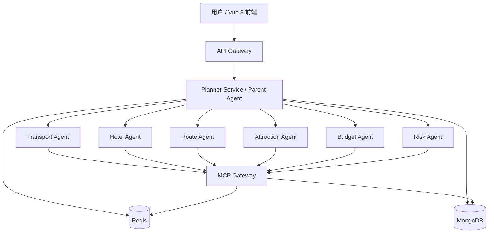

# 系统总体架构

## 1. 架构原则

- **中心控制，分布执行**：Parent Agent 保持全局约束一致性，子 Agent 负责领域推理
- **工具统一出口**：所有第三方 API 统一通过 `MCP Gateway`
- **状态可回放**：关键过程以快照、事件和审计日志形式落库
- **可重规划**：当预算超限、天气变化、交通不可达时自动触发重规划
- **上下文可压缩**：针对长会话采用滑动窗口 + 摘要记忆，降低 Token 成本

## 2. 逻辑分层

### 2.1 接入层

- `Vue 3 Frontend`
  - 旅行需求录入
  - 方案生成进度流式展示
  - 多方案对比与重规划操作
  - 订单占位、收藏、导出分享

- `API Gateway`
  - JWT 鉴权与会话创建
  - 请求参数校验
  - SSE/WebSocket 推流
  - 限流、审计、租户隔离

### 2.2 编排层

- `Planner Service`
  - 基于 `LangGraph` 构建 Parent Agent 状态图
  - 负责任务拆解、并行调度、结果聚合、冲突检查和重规划
  - 管理计划版本、快照和协作上下文

### 2.3 执行层

- `Agent Worker Cluster`
  - `Transport Agent Worker`
  - `Hotel Agent Worker`
  - `Route Agent Worker`
  - `Attraction Agent Worker`
  - `Budget Agent Worker`
  - `Risk Agent Worker`

每个 Worker 独立消费任务流，支持独立扩容和熔断隔离。

### 2.4 工具层

- `MCP Gateway`
  - 地图工具：高德地图 / 路线规划 / 地理编码
  - 交通工具：火车、航班、城市交通
  - 酒店工具：住宿搜索、价格与评分归一化
  - 天气工具：天气预报、预警信息
  - 票务工具：景点开放时间、门票、预约情况

### 2.5 数据层

- `Redis`
  - 请求级缓存
  - 工具结果缓存
  - Rate limiting
  - Redis Streams 任务总线
  - 向量缓存与语义相似查询

- `MongoDB`
  - 旅行计划快照
  - Agent 任务结果
  - 会话摘要
  - 审计日志
  - 重规划版本链

## 3. 多 Agent 拓扑

## 4. Parent Agent 状态机

推荐的 LangGraph 节点：

1. `collect_constraints`
   - 解析城市、日期、人数、预算、偏好、禁忌、出行方式
2. `build_initial_plan`
   - 输出任务列表、依赖图和优先级
3. `dispatch_domain_tasks`
   - 并行派发给领域子 Agent
4. `aggregate_results`
   - 汇总交通、酒店、景点、路线、预算与风险
5. `quality_gate`
   - 校验时间窗、预算、可达性、冲突与体验质量
6. `replan_if_needed`
   - 若存在冲突或风险，回到领域任务修正
7. `finalize_plan`
   - 生成最终日程、预算拆分、注意事项和备选方案
8. `persist_snapshot`
   - 写入 MongoDB，并在 Redis 中缓存热点摘要

## 5. 子 Agent 职责说明

### 5.1 Transport Agent

- 搜索跨城和城内交通方式
- 对比价格、耗时、换乘复杂度和准点风险
- 输出最优方案与备选方案

### 5.2 Hotel Agent

- 根据行程中心点与预算筛选酒店区域
- 对比价格、评分、退改规则、通勤时间
- 输出入住建议和房型策略

### 5.3 Route Agent

- 基于景点地理位置做聚类与日程编排
- 优化日均步行量、换乘次数与节奏
- 避免闭馆冲突和过密路线

### 5.4 Attraction Agent

- 生成 POI 候选池
- 读取开放时间、票价、预约规则和排队风险
- 根据用户偏好进行排序和补全

### 5.5 Budget Agent

- 汇总大交通、住宿、餐饮、门票、市内交通和机动费用
- 对超预算项给出替代方案
- 提供预算安全边界和灵活支出区间

### 5.6 Risk Agent

- 监控天气、交通延误、节假日拥堵、闭园和施工
- 输出风险等级、影响范围和应急替代方案

## 6. ReAct + Plan-Execute-Replan 闭环

### 6.1 ReAct

每个子 Agent 采用以下循环：

1. `Reason`：判断当前信息缺口和决策目标
2. `Act`：调用 MCP 工具或读取缓存
3. `Observe`：分析工具返回是否满足决策需要
4. `Reflect`：补充搜索、修正参数或向 Parent Agent 反馈不足

### 6.2 Replan 触发条件

出现以下情况时触发重规划：

- 总预算超限
- 关键交通不可达或换乘失败
- 某日路线超时或闭馆冲突
- 天气风险达到设定阈值
- 用户临时追加偏好或调整城市/日期

## 7. 上下文管理设计

### 7.1 分层上下文

- `Session Context`：用户会话级信息，保存在 Redis
- `Task Context`：单次规划过程中的结构化状态，保存在 LangGraph State
- `Snapshot Context`：规划版本和摘要，保存在 MongoDB

### 7.2 压缩策略

- 最近 6~10 轮保留完整消息
- 历史推理按“事实、约束、已决策、待验证”四类摘要压缩
- ToolMessage 单独裁剪，仅保留关键结果字段和引用 ID

## 8. 缓存与 RAG 策略

### 8.1 缓存分层

- L1：请求内缓存，避免同轮次重复调用
- L2：Redis 结果缓存，缓存城市天气、路线矩阵、景点开放信息
- L3：语义缓存，根据相似 query 命中历史工具结果摘要

### 8.2 RAG 用法

- 对热门城市建立景点、商圈、交通枢纽知识切片
- 对常见问法和历史行程结果建立可检索快照
- 作为子 Agent 的背景知识，降低外部 API 压力

## 9. 安全与治理

- JWT 鉴权 + 刷新令牌
- 按用户、IP、租户和接口维度做速率限制
- 工具调用白名单和参数 Schema 验证
- 敏感字段脱敏：手机号、证件号、邮箱、订单号
- 审计日志记录：谁在什么时候触发了什么规划和重规划
- 熔断与降级：外部工具超时后回退缓存结果或备选数据源

## 10. 高可用与扩展策略

- API Gateway 无状态部署，可横向扩容
- Planner Service 按会话分片部署，避免长链路互相影响
- Agent Worker 可针对热点能力单独扩容，例如节假日优先扩容 `Transport Agent`
- Redis 主从或哨兵；MongoDB 副本集部署
- MCP Gateway 做多实例部署，并按工具域拆分子模块
